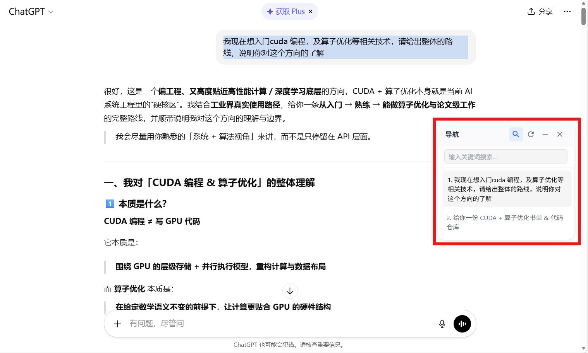

# 🚀 Chat Navigator (GPT 对话问题导航)

**Chat Navigator** 是一款专为 AI 聊天界面设计的用户脚本（UserScript）。它为 ChatGPT、Gemini、豆包、grok、claude、千问、deepseek等平台提供了一个悬浮导航面板，帮助你在单个聊天长对话中快速定位历史提问，提高查找效率。

## ✨ 核心特性

- **🎯 多网站兼容**：完美适配 ChatGPT, Gemini (Google AI), 豆包 (Doubao), 以及deepseek、Kimi。
- **🤏 智能交互**：
  - **自动吸附**：展开时根据面板位置智能选择向左或向右展开，防止超出屏幕。
  - **一键折叠**：点击面板或折叠按钮即可变为极简的小圆球，减少视觉干扰。
  - **快捷键支持**：使用 `Alt + Q` 快速显示或隐藏整个面板。
  - **便捷搜索**：可在搜索栏按照关键词搜索询问。
  - **导出内容**（图片 / Markdown / PDF）
- **🛡️ 安全可靠**：严格遵守原生 DOM 构建准则（无 `innerHTML`），兼容 Gemini 等高安全等级网站的 CSP 策略。

------

## 📦 安装方式

1. **准备环境**：确保你的浏览器已安装 [Tampermonkey (篡改猴)](https://www.tampermonkey.net/) 插件。
2. **一键安装**：点击下方的按钮，在弹出的窗口中点击“安装”或“更新”：

> [!IMPORTANT]

> 请根据你的需求选择版本安装：   
> 
> 稳定版（主线）：[🚀 点击此处一键安装脚本](https://github.com/hechen-coder/chat-navigator/raw/main/ChatNavigator.user.js)
>
> 增强版（2.8）：[🚀 点击此处一键安装脚本](https://github.com/hechen-coder/chat-navigator/raw/main/ChatNavigator_v2.8.user.js)

## 版本说明

### 主线版本（ChatNavigator.user.js）

- 聚焦“问题导航”与“快速跳转”
- 兼容主流站点的基础提问索引能力
- 交互轻量，适合只需要导航的场景

### 2.8 增强版（ChatNavigator_v2.8.user.js）

在主线能力基础上新增：

- 结构化会话抽取（role/text/html/el/index/time）
- 导出菜单（图片 / Markdown / PDF）
- Markdown 导出保留列表、代码块等格式（HTML -> Markdown）
- 导航刷新策略优化（去重与稳定性增强）
- 多站点选择器补全（含 Claude / Grok / Kimi / Qianwen 的回复容器适配）

## Gemini 不适配导出的原因

Gemini 页面启用了更严格的前端安全策略（Trusted Types / TrustedHTML 约束）。

这会导致很多常见的 HTML 渲染导出链路（包含第三方库内部实现）在执行时触发受限赋值，从而出现：

- `This document requires 'TrustedHTML' assignment`

因此在 2.8 中，Gemini 站点已明确关闭导出入口并给出提示，避免用户在该站点重复触发失败流程。

> 说明：导航功能仍可使用；当前限制仅针对导出流程。
> 
| **动作**            | **操作**                               |
| ------------------- | -------------------------------------- |
| **显示 / 隐藏面板** | `Alt + Q`                              |
| **折叠面板**        | 点击顶部的 `—` 图标                    |
| **移动位置**        | 鼠标按住面板顶部或折叠后的圆球进行拖拽 |
| **手动刷新列表**    | 点击顶部的 `↻` 图标                    |
| **展开面板**        | 点击折叠后的小圆球即可恢复             |

1. **页面展示：**

## 🤝 贡献与反馈

欢迎提交 Issue 或 Pull Request 来优化脚本！

## 📄 开源协议

本项目采用 [MIT License](https://www.google.com/search?q=LICENSE) 开源协议。